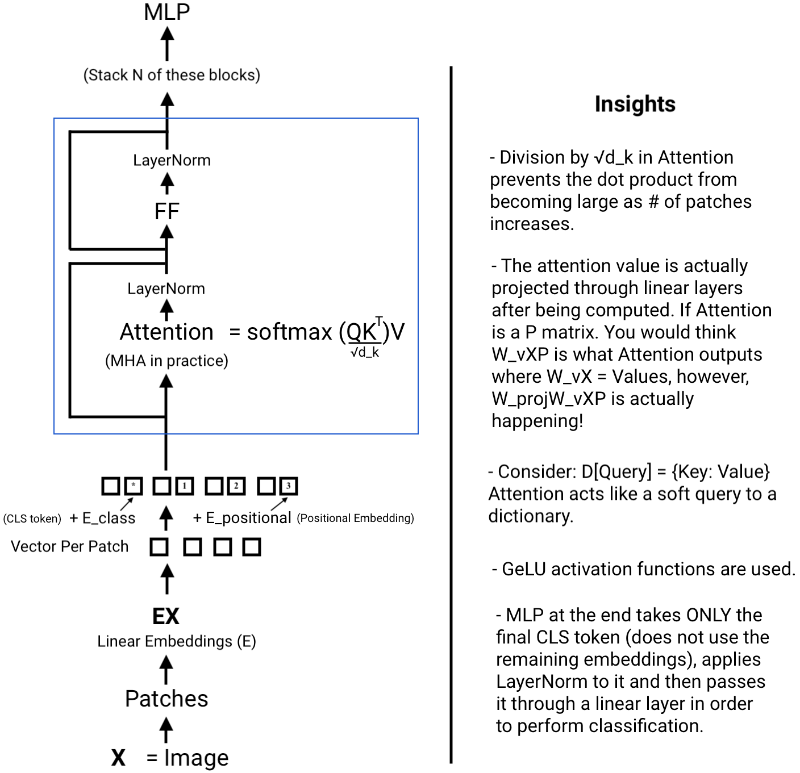
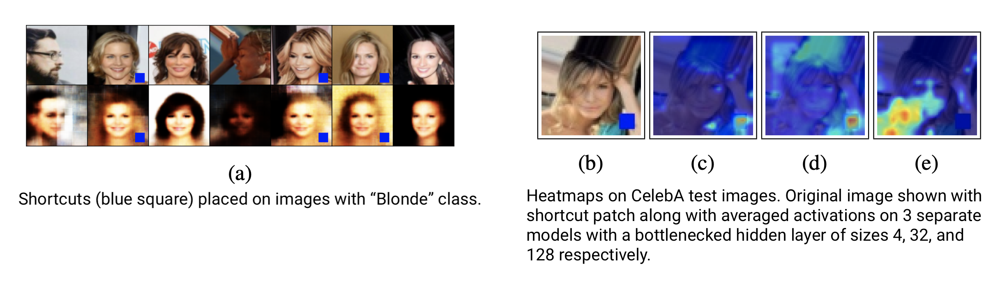
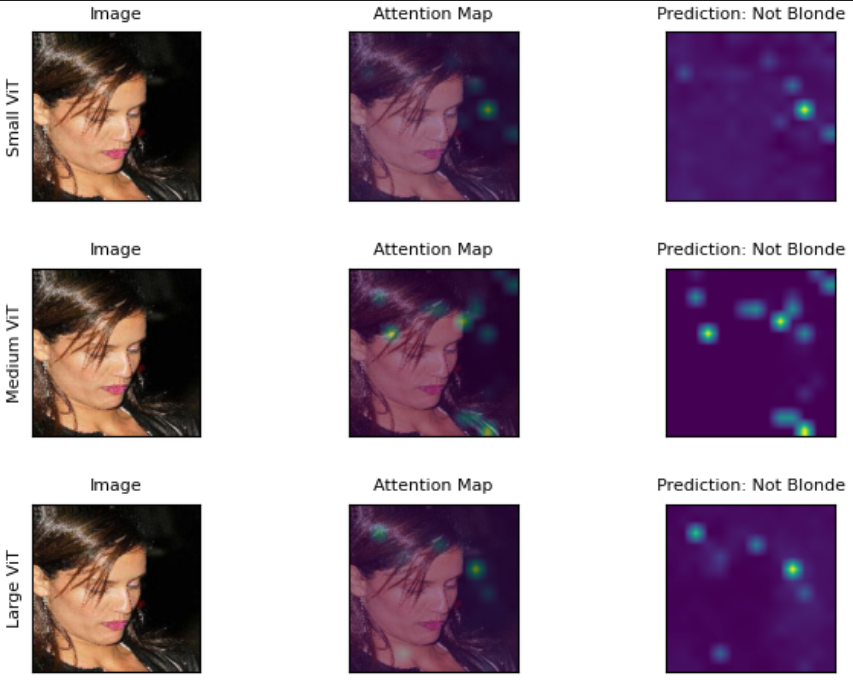
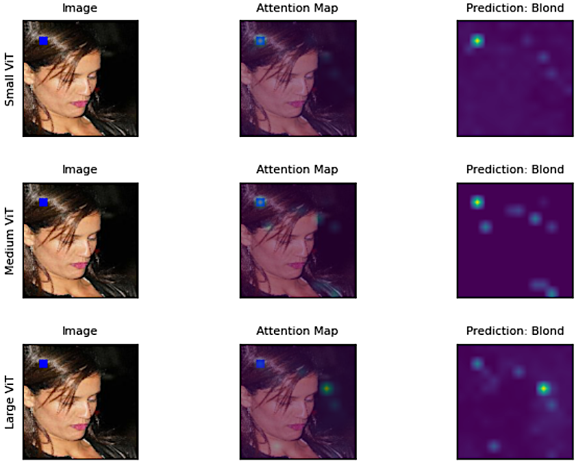

# Vision Transformer Implementation 

Notes and implementation of a Vision Transformer that I completed with [Aditya Mehrotra](https://github.com/AditMeh). 

## Motivation

The goal of this project was to deeply understand the [Vision Transformer paper](https://arxiv.org/abs/2010.11929). To do so, we studied the original paper and mapped out exactly what happens in the network, as shown below, and then coded it up.

We were studying the shortcut learning phenomena that was first introduced in the [Chroma-VAE paper](https://openreview.net/pdf?id=WWVcsfI0jGH). In the modified figure from the paper below, you can find a summary of the experimental setup. 

The interesting finding is: **The smaller the bottleneck, the more likely it is that the model only focuses on the shortcut patch. With more capacity, the model focuses on other regions of the image.**

## Replicating Experiment But With ViTs

After implementing the ViT, we added the shortcut to all the images of blonde celebrities in the [CelebA dataset](https://mmlab.ie.cuhk.edu.hk/projects/CelebA.html) and trained 3 ViT networks of varying sizes (where a Small ViT refers to a shallower network with fewer layers and a larger ViT refers to a deeper network with more layers). Once done, we checked which networks were most suceptible to shortcut learning. We did this by taking an image the network should correctly classify as "Not Blonde" such as the one shown below and visualizing the attention map and classification.

### ViT Performance Without Shortcut In Images

### ViT Performance With Shortcut In Image

Then, we added the shortcut to this image and tested which of the 3 ViTs would be most robust to the shortcut. 

Notice that all of the ViT's incorrectly classify the person as blonde as a result of the shortcut. This is a testament to the power a shortcut has on a network! However, by observing the attention maps we do see the same pattern that was identified in the other Chroma-VAE paper but for the ViT: **The smaller the ViT, the more likely it is that the model only focuses on the shortcut patch. With more capacity, the ViT focuses on other regions of the image.**
